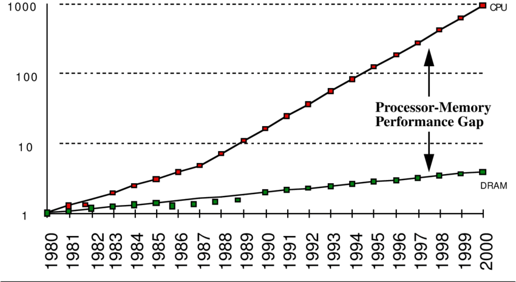
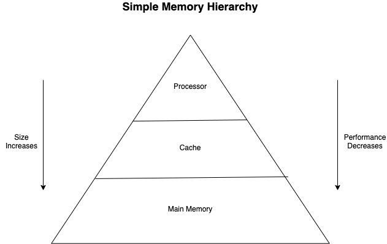

# Cache - Lesson Draft 

## Exercise 1: Introduction
### Narrative
- Introduce analogy
  - food analogy (counter/pantry/supermarket)
  - tool analogy (hand/work bench/tool chest) from book
  - garden (supplies at garden/supplies in shed/supplies from gardener)
- Introduce cache using analogy
- Summarize lesson/exercises

It's a nice day out today and you have decided to work in your garden. You have with you a pair of gloves, a shovel and flowers in pots. You mark out the perfect spots for each flower and start to dig the holes. After digging the holes you realize you want to use a special fertilizer for the garden. You don't have the fertilizer so you go to the garden store to pick some up. 

Getting the fertilizer from the store takes some time since you have to take the bus then find the fertilizer in the many aisles in the store. Once you find the fertilizer in the store you decide to buy extra to keep in your backyard shed. This way if you need fertilizer for your next project you'll have it and only have to get it from the shed. When you get back to your garden you use the fertilizer plant the flowers and enjoy a job well done.

This is a lesson on CPU Cache memory so why are you gardening. The fertilizer, its location and what it means to spend time to retrieve and store it in the shed is a good example of how a computer accesses memory. In the following exercises we will explore how minimize the delay in processing when access data from memory by introducing you to _Cache memory_. Just like the shed in our gardening example Cache memory is a place we can keep something we need to retrieve faster. By introducing cache in between the cpu and main memory, we are creating what is known as a _memory hierarchy_.

### Instructions
**CP1**
Move to the next exercise to get started with Caches

## Exercise 2: Memory Hierarchy

### Narrative
- Processor/memory gap
- Big memory slow, small memory fast
- Registers -> Fast but small – Memory -> big but slow
- Let’s put something in between

So what is a memory hierarchy and why is it important? Let's answer the second part of that question by looking at the graph below. 

There are two lines, one for processor performance and one for memory performance. As time passes, processor performance increases at a much higher rate than that of memory. This results in a computer that can process data much faster than it can retrieve data from memory. This is known as the processor-memory performance gap and is the motivation behind creating a memory hierarchy.

The gardening example from the previous exercise had you working in your garden until you needed to stop to get fertilizer from the store. The garden and the few tools you have are equivalent to the processor and data in the registers. Retrieving the fertilizer from the store is the same as retrieving data from memory. It's a slow process, but everything you need is there and you can get to both by bus ;-).

The image above represents a simple memory hierarchy. At the top is the processor (your garden) with the best performance but can only hold a small amount of data. At the bottom is memory (the garden store) with the decrease performance but increased size. This memory is the DRAM/SDRAM/DDR memory used widely in computers today. Throughout this lesson we will refer to it as main memory. 

The middle section of the memory hierarchy is cache and is equivalent to your storage shed where the extra fertilizer you brought home is stored. Cache memory is what we will cover for the rest of this lesson by showing how it helps bridge the processor memory performance gap.

### Checkpoints
**CP1**

- Explain the code to be used for the lesson.
- Run the code, notice the memory can't be found.

Throughout this lesson you will be working with a small memory hierarchy that outputs a string by bringing characters from memory. 

**Hint**

**CP2**

- 
- Ask the learner to configure the architecture to use main memory.
- (NO?)Call the architecture `read_code()` method with `"code.txt"` as the argument.
- Run code, explain output.

## Exercise 3: Cache Memory

### Narrative
- Cache is made up of blocks
- Cache entries hold data and memory location
- For a memory request, the processor will check the cache first and will either result in a cache hit or a cache miss.

Cache memory can hold more data than the processor but less than main memory. It's increased size means data retrieval is slower than within the processor but is faster than from main memory. Cache memory can been seen as a compromise between the processor and main memory, yet this isn't what helps bridge the performance gap. The structure and the behavior of cache is what leads to increased data retrieval.

Cache is made up of _blocks_ that are fixed in size. Each block is used to store a copy of data from main memory. For example, a cache that has a total storage capacity of 32kB where each block hold 64 bytes will have a total of 32,768/64 blocks, or 512 block.

Unlike memory, cache blocks are not assigned unique addresses. When a piece of data is stored in cache, it is paired with the address of the data in main memory. The address stored in a cache block is dependent on the data and where it came from in memory. This simplifies retrieval since the processor uses the same address when accessing data from cache or main memory.

### Checkpoints
**CP1**
- Introduce Cache class (already implemented with `MainMemory` as next tier and `size` set)
- Learner will add the memory block variable(s)

**Hint**

**CP2**
- Create a class function `read()`.
- Inside the function call the parent class `read()` function using `super()` and place the return value in a variable called `byte`.
- return byte 

**Hint**

**CP3**

- In **app.py** create an instance of `Cache()` and put it in the variable `cache_memory` 
- Change memory of architecture to `cache_memory`

Run the code. Out put will be the same since `Cache()` is just a pass through for now.

**Hint**

## Exercise 4: Cache Miss

### Narrative
- When the data isn't in the cache it is a cache miss.
- A new entry is created and the data and memory address are collected
- Hint at replacement policy by saying for now the cache entries will be replaced using either FIFO or random.

With cache in the memory hierarchy, each data request by the processor will first go to the cache. 

### Checkpoints
**CP1**

**Hint**

**CP2**

**Hint**

**CP3**

**Hint**

**CP4**

**Hint**

## Exercise 5: Cache Hit

### Narrative
- A cache hit is what increases bridges the performance gap.
- Cache entries are checked for needed data, if found that's a cache hit.
  
When the processor goes to retrieve data from a specific address in main memory, it first looks for the address in cache. If found, it retrieves the data paired with the address.

### Checkpoints
**CP1**

**Hint**

**CP2**

**Hint**

**CP3**

**Hint**

**CP4**

**Hint**

## Exercise 6: Replacement Policy (Possibly Expand to 2 exercises)

### Narrative
- Cache is only effective when there is data we can use in it. This is helped with a replacement policy.
- Random (or start with the policy implementing in the previous exercise)
- LRU
- FIFO
  
### Checkpoints
**CP1**

**Hint**

**CP2**

**Hint**

**CP3**

**Hint**

**CP4**

**Hint**

## Exercise 7: Cache Mapping

### Narrative
- Deciding where in the cache to store memory locations can affect performance.
- Fully associative
- Direct-Mapped
- Compare and contrast the 2 
- Set associative can be a happy medium. 
  
### Checkpoints
**CP1**

**Hint**

**CP2**

**Hint**

**CP3**

**Hint**

**CP4**

**Hint**

## Exercise 8: Cache Write

### Narrative
- Writes to memory are not common (Hennessy and Patterson, find the figure, not in my book)
- Still important to create a write policy
- Write-through
- Write-back
  
### Checkpoints
**CP1**

**Hint**

**CP2**

**Hint**

**CP3**

**Hint**

**CP4**

**Hint**

## Exercise 9: Summary

### Narrative
- Summarize each topic

### Checkpoints
**CP1**

**Hint**

**CP2**

**Hint**

**CP3**

**Hint**

**CP4**

**Hint**

