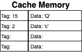

# Cache - Lesson Draft 

## Exercise 1: Introduction
### Narrative
- Introduce analogy
  - food analogy (counter/pantry/supermarket)
  - tool analogy (hand/work bench/tool chest) from book
  - garden (supplies at garden/supplies in shed/supplies from gardener)
- Introduce cache using analogy
- Summarize lesson/exercises

It's a nice day out today and you have decided to work in your garden. You have with you a pair of gloves, a shovel and flowers in pots. You mark out the perfect spots for each flower and start to dig the holes. After digging the holes you realize you want to use a special fertilizer for the garden. You don't have the fertilizer so you go to the garden store to pick some up. 

Getting the fertilizer from the store takes some time since you have to take the bus then find the fertilizer in the many aisles in the store. Once you find the fertilizer in the store you decide to buy extra to keep in your backyard shed. This way if you need fertilizer for your next project you'll have it and only have to get it from the shed. When you get back to your garden you use the fertilizer plant the flowers and enjoy a job well done.

This is a lesson on CPU Cache memory so why are you gardening. The fertilizer, its location and what it means to spend time to retrieve and store it in the shed is a good example of how a computer accesses memory. In the following exercises we will explore how minimize the delay in processing when access data from memory by introducing you to _Cache memory_. Just like the shed in our gardening example Cache memory is a place we can keep something we need to retrieve faster. By introducing cache in between the cpu and main memory, we are creating what is known as a _memory hierarchy_.

### Instructions
**CP1**
Move to the next exercise to get started with Caches

## Exercise 2: Memory Hierarchy

### Narrative
- Processor/memory gap
- Big memory slow, small memory fast
- Registers -> Fast but small – Memory -> big but slow
- Let’s put something in between

So what is a memory hierarchy and why is it important? Let's answer the second part of that question by looking at the graph below. 

There are two lines, one for processor performance and one for memory performance. As time passes, processor performance increases at a much higher rate than that of memory. This results in a computer that can process data much faster than it can retrieve data from memory. This is known as the processor-memory performance gap and is the motivation behind creating a memory hierarchy.

The gardening example from the previous exercise had you working in your garden until you needed to stop to get fertilizer from the store. The garden and the few tools you have are equivalent to the processor and data in the registers. Retrieving the fertilizer from the store is the same as retrieving data from memory. It's a slow process, but everything you need is there and you can get to both by bus ;-).

The image above represents a simple memory hierarchy. At the top is the processor (your garden) with the best performance but can only hold a small amount of data. At the bottom is memory (the garden store) with the decrease performance but increased size. This memory is the DRAM/SDRAM/DDR memory used widely in computers today. Throughout this lesson we will refer to it as main memory. 

The middle section of the memory hierarchy is cache and is equivalent to your storage shed where the extra fertilizer you brought home is stored. Cache memory is what we will cover for the rest of this lesson by showing how it helps bridge the processor memory performance gap.

### Checkpoints
**CP1**

Throughout this lesson you will work with a simulated memory hierarchy. Feel free to look around the files, but you will not need to know how everything works.

The code consists of 3 files:
- **isa.py:** implements a simple architecture including registers and a reference to the next level pf memory in the hierarchy. The module also defines few memory access commands and allow for the reading of instructions from a file.
- **memory.py** defines the different memory types included in the architecture. To start there is a generic memory class `Memory()` which the `Register()` and `MainMemory()` classes inherit from. The distinctive features of each memory type are the data size and the access time.
- **app.py** is the file you will use to configure the architecture and output important information regarding the memory access process.

Currently **app.py** defines an instance of the `ISA()` class and assigns it to `cache_arch`. This will be the simulated architecture that will be used to run code to access the memory hierarchy. The `read_instructions` method is called and passed a text file with instructions, **code.txt**.

To start with the simulation, run the code to see output that explains there is no memory found in the architecture.

**Hint**

**CP2**

- Ask the learner to configure the architecture to use main memory.
- (NO?)Call the architecture `read_code()` method with `"code.txt"` as the argument.
- Run code, explain output.

Currently, there are 2 memory classes in this simulation, `Register()` and `Main_Memory()`. The `Register()` class has a size of 2, an access time of 0.05 seconds and is used within the `ISA()` class. The `Main Memory()` class has a size of 16, an access time of 1 second and is not currently not used. Let's add `Main_Memory()` to the architecture so when a memory read occurs it will go to the data in the architectures main memory.

To add a main memory to the architecture call the `set_memory()` method from `cache_arch` and pass it a call to `MainMemory()`.

When you run the code you will see each memory access instruction output a description of what is happening. The program will finish by outputting a text string of all the data accessed from the memory along with the time the simulation took to run. 

**Hint**

Call `cache_arch.set_memory()` with `MainMemory()`. Use the following syntax:

`ISA_instance.method(MemorySubClass())`

## Exercise 3: Cache Memory

### Narrative
- Cache is made up of blocks
- Cache entries hold data and memory location
- For a memory request, the processor will check the cache first and will either result in a cache hit or a cache miss.
- A cache hit is what increases bridges the performance gap.
- Cache entries are checked for needed data, if found that's a cache hit.

Cache memory can hold more data than the processor but less than main memory. Its size means data retrieval is slower than within the processor but is faster than from main memory. Cache memory performance and size is a compromise between the processor and main memory. But this isn't what helps bridge the performance gap. The structure and the behavior of cache is what leads to increased data retrieval.

Cache is made up of _blocks_ equal in size. Each block stores a copy of data from main memory. Unlike memory, cache blocks are not assigned addresses. When a piece of data is stored in cache, it is paired with a _tag_ which is equal to the address of the data in main memory. This simplifies retrieval since the processor uses the same address when accessing data from cache and main memory.

The diagram above represents a small cache with 4 blocks. The cache has two elements of data from main memory: the character `'Q'` with a tag `15` and the character `'c'` with a tag `2`. Remember the tag is the main memory address of the data. When the processor requests data from a main memory address it will first search for that address in the cache. If any of the blocks has a tag with the requested address a _cache hit_ occurs.

In the animation there is a processor, main memory with a cache in the middle. The processor requests the data located at main memory address `2`. The address is found inside the cache so a cache hit occurs. The character `'c'` will be returned from cache and the main memory is never accessed. The goal of the memory hierarchy is to get as many cache hits when requesting data from memory.

### Checkpoints
**CP1**

In **cache.py**, the class `Cache()` inherits from the `Memory()` class. The `__init__` method defines 3 variables:
- `self.size`: equal to 4, this defines the number of blocks in the Cache()
- `self.data`: assigned a list of 4 dictionaries, each with `'tag'` and `'data'` keys. This data is hard coded for this exercise.
- `self.sim_read`: assigned the `sim_read()` method of the super class `Memory()`. This pauses the program for the set access time and produces output.
  
The `__init__` method finishes off with a call to the `Memory()__init__()` with the arguments: 
- `"Cache"` for the name string
- `0.1` for the access_time 

Data is retrieved when the architecture calls `read()` from its memory. In **app.py* start using cache as memory by replacing `Main_Memory()` with `Cache()` in the `set_memory()`

When you run the code there should be a `NO DATA` error output with the instruction output. This is because the cache does not have a `read()` method yet.

**Hint**

**CP2**

Back in **cache.py**, the data pre-populated in the `Cache()` class's `self.data` variable has all the characters needed for the executed instructions. This will result in only cache hits. The method `is_hit()`, takes a memory address and searches for it in `self.data`. If it finds the address, `CACHE HIT` is output and it returns the cache entry as a dictionary. If it doesn't find it, `CACHE MISS` is output and `None` is returned.

In **cache.py**: 
- Define the `read()` method with `self` and `address` as the parameters.
- Inside the method, define an `entry` variable and assign it a call to `is_hit()` with `address` as the parameter.

When you run the code, the output should now indicate a cache hit on each read along with the `NO DATA` error.

**Hint**

**CP3**

Now you need to check if `is_hit()` is a cache hit.

After the `entry` variable definition:
- Write an `if` statement that checks if `entry` is not equal to `None`.
- Inside the `if` statement, call `self.sim_read()` to simulate the access time for the cache.

Running the code should output with `Cache read: ` and the duration should be a little longer with the simulated access time.

**Hint**

**CP4**

The last step is to output and return the data retrieved from cache.

Inside the `read()` method `if` statement:
- Define `data` and assign it the value in `entry["data"]`.
- Output `data` with a `print()` statement.
- `return` the `data` variable.

The output should now show each character retrieved from cache at the end of each line. The output string should be complete.

**Hint**

## Exercise 4: Cache Miss

### Narrative
- When the data isn't in the cache it is a cache miss.
- A new entry is created and the data and memory address are collected
- Hint at replacement policy by saying for now the cache entries will be replaced using either FIFO or random.

When the data requested from the processor isn't in cache, a _cache miss_ occurs. 

In the above animation of a cache miss, the data request first goes to the cache. A cache mis occurs and the request goes to main memory. The memory address and retrieved data will then be placed in cache. Finally, the processor will finish the request by retrieving the data from the cache.

A cache miss is what populates data in the cache. But since cache has a quicker access time than main memory a cache hit is preferable to a cache miss. The goal of the cache is to keep the data that will result in the most cache hits and limit the cache misses.

### Checkpoints
- Cache empty, memory has all data, output Mississippi
**CP1**

To work on cache misses the `Cache()` class has added a variable, `self.main_memory`, which is assigned an instance of `Main_Memory()`. The `Cache()` class is now starting with empty `self.data`. These two changes will allow the cache to read data from main memory when a cache miss occurs.

Run the code to observe that the empty cache causes all cache misses. The output indicates `NO DATA` because the cache does not retrieve anything from main memory yet.

**Hint**

**CP2**

In **cache.py** add the cache miss behavior.

Inside the `read()` method:
- Add and `else` clause at the end of the `if` statement.
- Define a `data` variable and assign it a call to the `read()` method of `self.main_memory` with `address` as the argument.

The output now indicates a read from main memory and the duration is greater. 

**Hint**

**CP3**

The `add_entry()` method has been added to the `Cache()` class. It is used to add an entry to cache given the memory address and data. 

Inside the `else` clause:
- Call `self.add_entry()` with `address` and `data` as arguments.

**Hint**

**CP4**

The last step is to retrieve the data from cache and return it. 

Inside the `else` clause:
- Call `self.sim_read()` to simulate a cache access.
- Output `data` with a `print()` statement.
- `return` the `data` variable.

Running the code will start with cache misses, but result in cache hits once the data is found in the cache.

**Hint**

## Exercise 5: Replacement Policy

### Narrative
- Cache is only effective when there is data we can use in it. This is helped with a replacement policy.
- Random (or start with the policy implementing in the previous exercise)
- LRU
- FIFO

In the previous exercise, we looked at a half empty cache and added entries to that. But what happens when the cache is full and a cache miss occurs? The incoming data will need to replace an existing data entry in the cache, but which data entry?

The decision about which populated entry will be replaced with new data is made by the cache's _replacement policy_. A replacement policy might use information about each cache entry in order decide which to replace. This approach comes at a cost of collecting and processing the information on each entry. Here are some examples of replacement policies:
- First In First Out (FIFO): known also as round robin, this policy replaces the entries in the order that they came in to the cache. An index is maintained that points to the next entry to be replaced. After replacement, the index is incremented or set back to the first entry if the last entry was just replaced.
- Least Recently Used (LRU): this policy replaces the with the most time passed since it was last accessed. This requires that each entry have a way to keep track of when it was last accessed compared to the other entries. 
- Random Replacement: this policy chooses a cache entry at random. While there is some work involved in this policy the cost tends to be less than both the FIFO and LRU policies.

The correct replacement policy is key to increasing the number of cache hits a processor has. The random replacement policy is simple to implement but might cause more cache hits than the other 2 policies. The LRU policy is more complicated but does a better job at keeping data in the cache that will be used again. In fact, the LRU policy has been expanded to multiple policies that look at an entries "age" as a way to decide which one to replace. 
  
### Checkpoints
- Cache is empty or half full, output This is Mississippi. random already implemented?
**CP1**

**Hint**

**CP2**

**Hint**

**CP3**

**Hint**

**CP4**

**Hint**

## Exercise 6: Cache Associativity 

### Narrative
- Deciding where in the cache to store memory locations can affect performance.
- Fully associative
- Direct-Mapped
- Compare and contrast the 2 
- Set associative can be a happy medium. 

Up until now, main memory data has been placed in any block in the cache. Is this the best way? What if each location in main memory has only 1 block in cache it can go? Associating memory locations to specified cache blocks is called cache associativity. 

#### Fully Associative
This has been the behavior of the cache through out this lesson. Each location in main memory can go to any block in the cache. This cache associativity requires a replacement policy that involves every entry in the cache.

#### Direct Mapped
When every location in main memory can only be placed in one specified block in cache, this is know as direct mapped cache. This associativity does not require a replacement policy since there is only one option for the data in main memory to be placed in cache.

#### n-Way Set Associative
This cache associativity breaks the cache into sets of _n_ blocks. Each location in main memory is mapped to a specified set of blocks. This requires a replacement policy but one that only keeps track of _n_ blocks in each set. The example cache with 2 blocks per set is called 2-way set associative and has a total of 2 sets that main memory locations can be mapped to. 

Fully associative and direct mapped cache are each set associative caches. A fully associative cache with 32 blocks is considered to be 32-way set associative with one set. A direct mapped cache with 32 blocks is considered to be 1-way set associative with 32 sets. 

The associativity and replacement policy of a cache work together with a memory hierarchy to minimize cache misses. Computer architecture designs can implement these two characteristics of a cache in a way to maximize performance based on other architecture design decisions. 

### Checkpoints
**CP1**

**Hint**

**CP2**

**Hint**

**CP3**

**Hint**

**CP4**

**Hint**

## Exercise 7: Write Policy

### Narrative
- Writes to memory are not common (Hennessy and Patterson, find the figure, not in my book)
- Still important to create a write policy
- Write-through
- Write-back

So far the exercises have covered reading from memory. What about writing to memory. While writing to memory does not happen as much as reading from memory, there are still specific cache behaviors when data is to down the memory hierarchy. 

When the processor writes data to memory it is always written to cache. The memory address is searched in the tags of the cache entries. If the address is found the data is overwritten in the cache. If it is not found the replacement policy is used to decide which entry will be replaced with the new data. The decision of when to send data to main memory is made by the cache _write policy_.

#### Write-through
The write-through policy will write the data to main memory at the same time it is written to cache. This policy is easy to implement since there are no decisions that need to be made after the data is written to cache. The downside is that every write will require a slower memory access.

#### Write-back
The write back policy will only write the data to main memory when the entry in the associated entry in cache is overwritten. This policy is more complicated to implement because the data in cache now has to be monitored. For example, if data is written into cache and is no longer needed by the processor, the cache entry should not be written to main memory. This designation is known as a cache entry becoming dirty, which is something the cache needs to keep track of when the write-back policy is implemented. The benefit of the write-back policy is that every write does not access main memory. When an entry becomes dirty the data can now be overwritten without the memory ever being accessed.
  
### Checkpoints
**CP1**

**Hint**

**CP2**

**Hint**

**CP3**

**Hint**

**CP4**

**Hint**

## Exercise 8: Summary

### Narrative
- Memory hierarchy
- The introduction of cache memory into the memory hierarchy is the solution to bridging the processor-memory performance gap.
- Copies of data are stored in cache to give the processor quicker access to the data compared to main memory.
- A cache hit is when requested data is located in the cache.
- A cache miss is when requested data is not located in the cache and the data must be retrieved from main memory.
- A cache replacement policy defines what entry in cache will be replaced by new data.
- Cache associativity assigns main memory locations to specified cache entries.
- A cache write policy defines how data is written back down the memory hierarchy.

### Checkpoints
**CP1**

**Hint**

**CP2**

**Hint**

**CP3**

**Hint**

**CP4**

**Hint**

